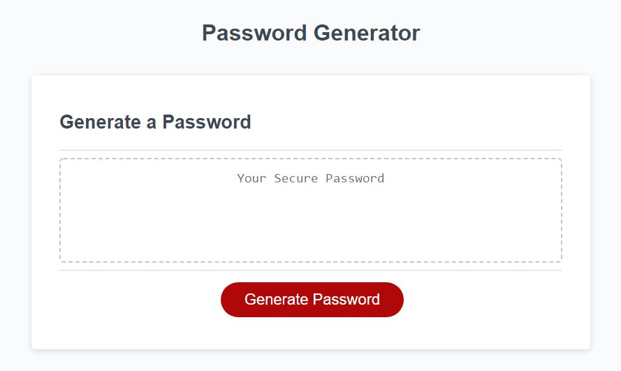
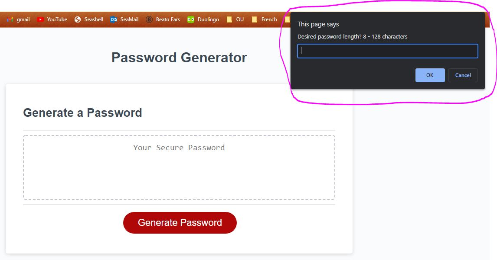
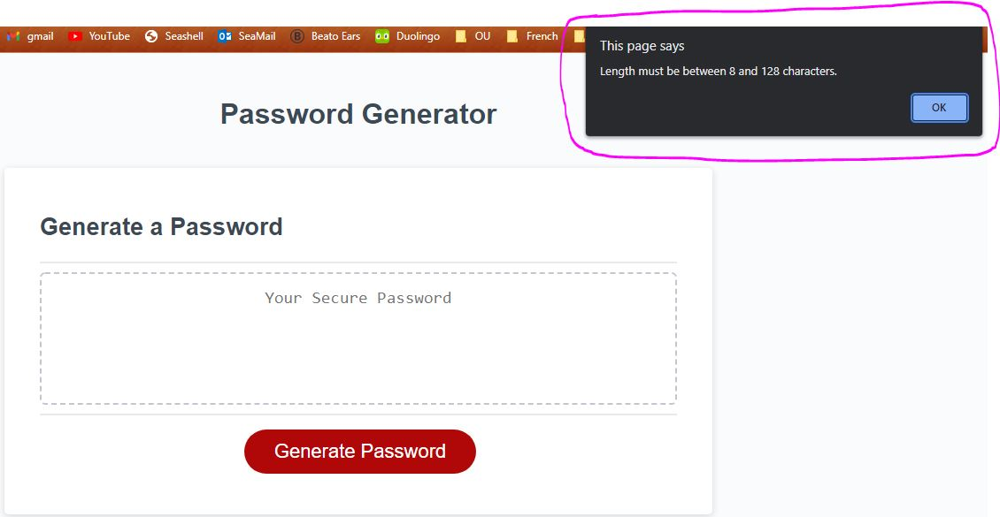
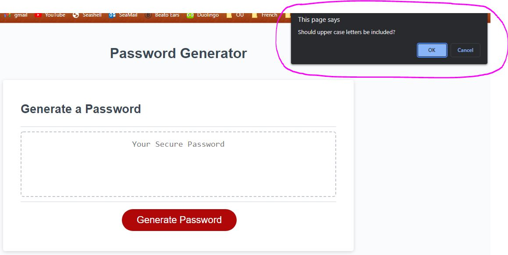
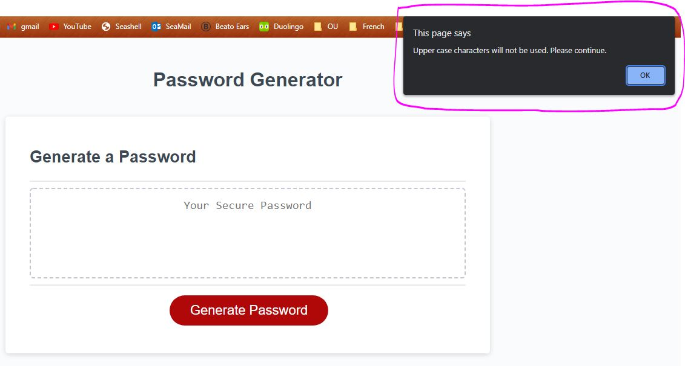
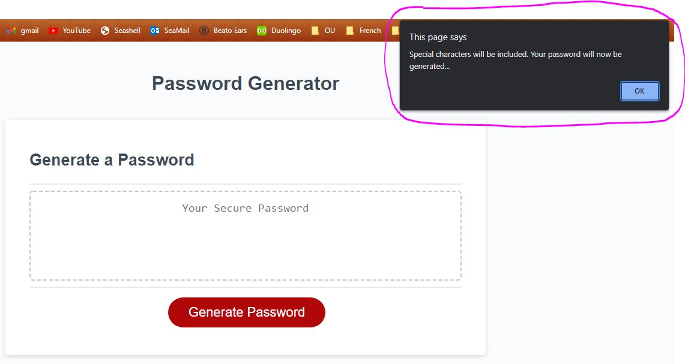
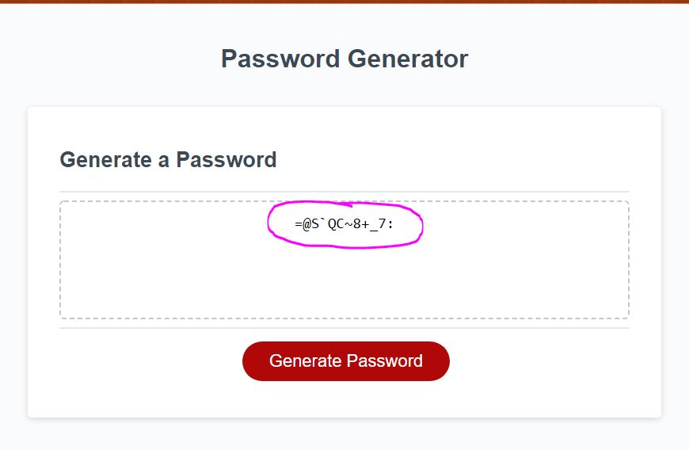

# JAVSCRIPT PASSWORD GENERATOR
Vienna Borowska - University of Manchester Coding Bootcamp - vienna.borowska@hotmail.com

# DEPLOYED URL
https://viennaborowska.github.io/Password-Generator/

# LANGUAGE
HTML, CSS & JavaScript

# DESCRIPTION
## This site uses HTML, CSS and JavaScript to create a random password generator. 

## Users are presented with a clear, easily navigable webpage with a single button to generate a password:

  

## Once the button is clicked, the first prompt appears to select the password length:

 

## If the length chosen is outside the set parameters (1-128), an error is thrown;

 

## Once an acceptable selection is made, the user is prompted for 4 character selections: Uppercase, Lowercase, Numbers and Symbols:

 

## Each selection is validated:

 

## Once all valid selections have been made, user is alerted that password will be generated:

 

## Password is generated and printed to the HTML textarea on screen:

 

## FILES
* README.md - contact information, file information
* index.html - HTML code
* style.css - CSS stylesheet
* script.js - JavaScript file

